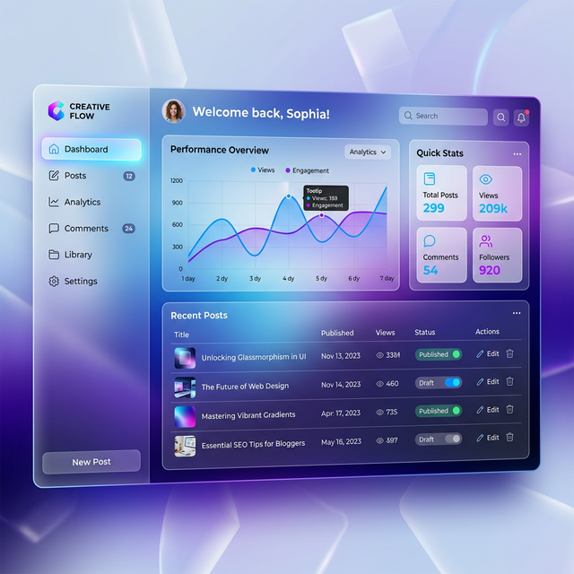

# 🚀 GHAS Blog Practice



[](https://react.dev/)
[](https://vitejs.dev/)
[](https://firebase.google.com/)
[](https://opensource.org/licenses/MIT)

**GHAS Blog Practice**는 React와 Firebase를 기반으로 구축된 현대적이고 세련된 개인 블로그 프로젝트입니다. 직관적인 UI와 실시간 데이터 처리를 통해 빠르고 안정적인 블로깅 경험을 제공합니다.

---

## ✨ Key Features

- **🔐 Firebase Authentication**: 로그인 및 이메일 기반 인증 시스템 구축.
- **📝 Markdown Support**: `react-markdown`을 활용한 편리한 글 작성 및 렌더링.
- **🖼️ Image Management**: Firestore를 이용한 대표 이미지 탐지 및 Base64 데이터 스토리지 활용.
- **☁️ Weather Integration**: 실시간 날씨 데이터 fetching 및 UI 표시.
- **📱 Responsive Design**: 모바일, 태블릿, 데스크탑 모든 환경에 최적화된 반응형 레이아웃.
- **🔥 Real-time Updates**: Firebase Firestore를 활용한 실시간 게시글 동기화.

---

## 🛠️ Tech Stack

### Frontend
- **Framework**: React 19 (Vite)
- **Routing**: React Router DOM v7
- **Styling**: Vanilla CSS (Custom Glassmorphism)
- **Icons**: Lucide React
- **Date Handling**: date-fns

### Backend (Firebase)
- **Database**: Cloud Firestore
- **Authentication**: Firebase Auth
- **Hosting**: Firebase Hosting

---

## 🏗️ Project Structure

```text
src/
├── assets/         # static assets (images, logos)
├── components/     # UI reusable components
├── context/        # React Context API for state management
├── pages/          # Full page components (Home, Post, Login, etc.)
├── firebase.js     # Firebase configuration and initialization
└── index.css       # Global styles & design system
```

---

## ⚙️ Installation & Setup

1. **Repository를 클론합니다:**
   ```bash
   git clone https://github.com/luka0116kjh/ghasblog.git
   cd ghasblog
   ```

2. **의존성 라이브러리를 설치합니다:**
   ```bash
   npm install
   ```

3. **Firebase 설정:**
   `src/firebase.js` 파일에 자신의 Firebase API Key 정보를 추가합니다.

4. **개발 서버를 프로젝트 실행합니다:**
   ```bash
   npm run dev
   ```

---

## 📝 License

Distributed under the MIT License. See `LICENSE` for more information.

---

## 👤 Author

**GHAS (Luka)**
- GitHub: [@luka0116kjh](https://github.com/luka0116kjh)
